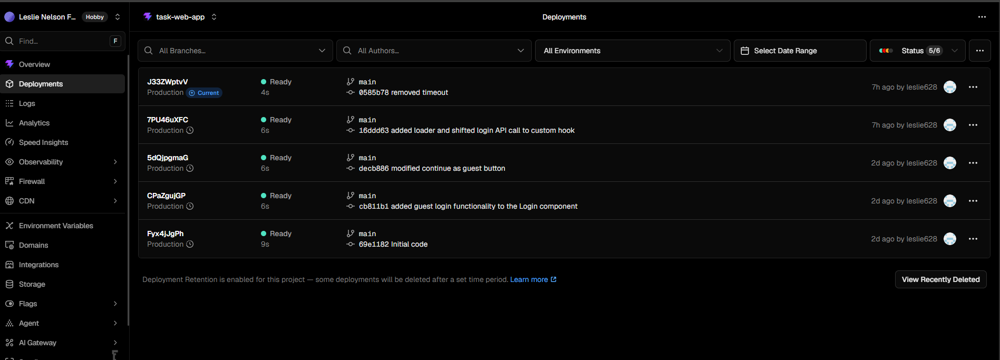
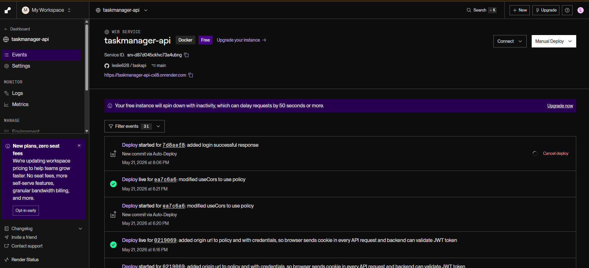
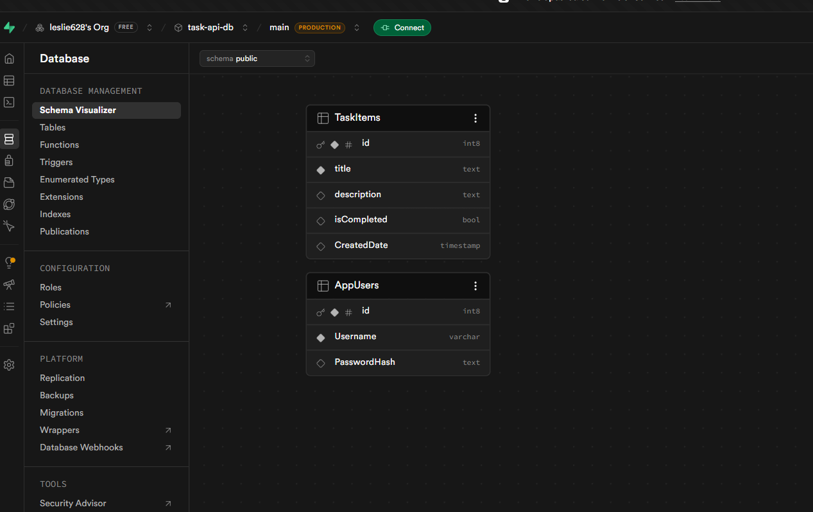
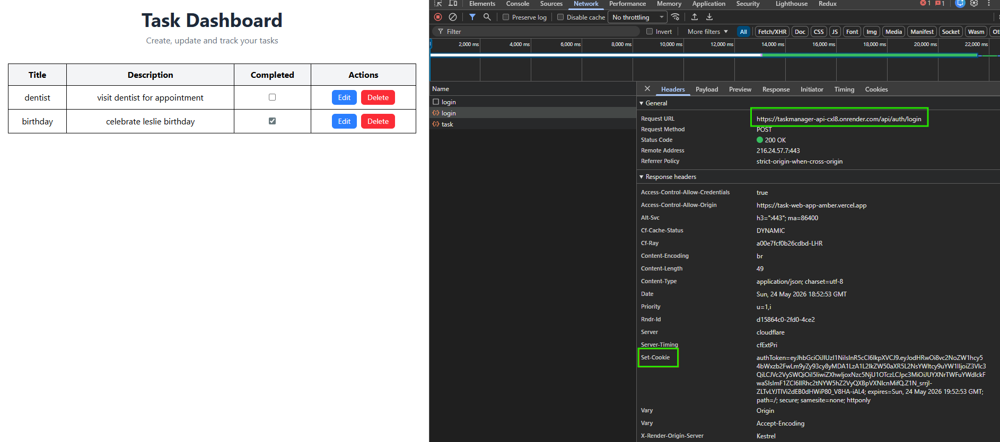
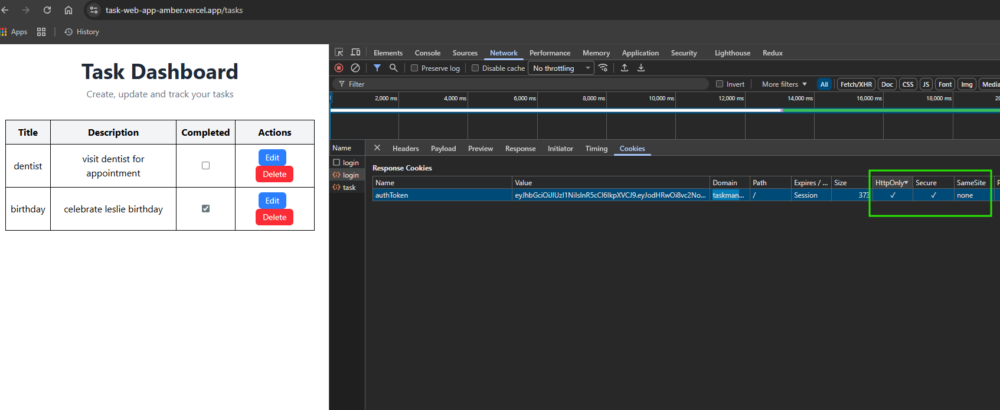

# Task Manager App (Full Stack)
A full-stack task management application built with React (Vite) for the frontend and ASP.NET Core Web API for the backend. The application supports secure authentication using JWT stored in HttpOnly cookies and full CRUD operations for tasks.

# Live Demo
🌐 Frontend: https://task-web-app-amber.vercel.app/ 
⚙️ Backend API: https://taskmanager-api-cxl8.onrender.com  
Backend Code: https://github.com/leslie628/taskapi

# Features
## Authentication
* User Registration
* Secure Login
* JWT based authentication
* HttpOnly cookie session handling
* Guest Login option

## Task Management
* List Tasks
* Create Tasks
* Edit Tasks
* Delete Tasks
* Mark Task as completed
## Architecture

                ┌──────────────────────────────┐
                │          Frontend            │
                │     React + Vite App         │
                │     (Hosted on Vercel)       │
                └─────────────┬────────────────┘
                              │
                              │ HTTPS Requests
                              ▼
                ┌──────────────────────────────┐
                │        Backend API           │
                │   ASP.NET Core Web API       │
                │   (Hosted on Render)         │
                │                              │
                │ - Authentication (JWT)       │
                │ - Task CRUD APIs             │
                │ - Cookie-based auth          │
                └─────────────┬────────────────┘
                              │
                              ▼
                ┌──────────────────────────────┐
                │     Render PostgreSQL DB     │
                │                              │
                │ - Users                      │
                │ - Tasks                      │
                └──────────────────────────────┘

        ┌────────────────────────────────────────────┐
        │           Authentication Layer             │
        │  ✔ JWT stored in HttpOnly Cookies          │
        │  ✔ Auto-attached to API requests           │
        │  ✔ Secure session management               │
        └────────────────────────────────────────────┘

## Vercel frontend auto deploy

## Task manager API auto deploy

## Supabase Db Schema

## API Header Request Cookie attached

## Secure API requests with HttpOnly cookie

